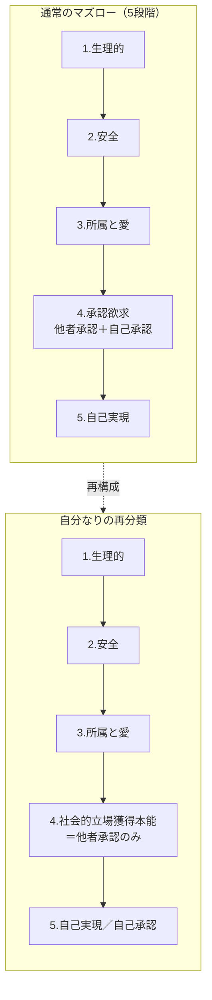
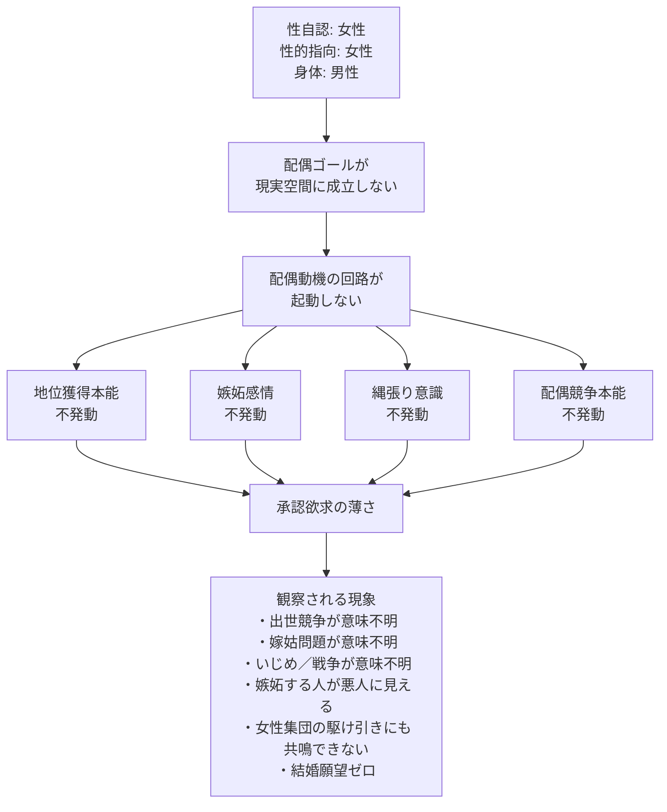

---
tags:
  - 承認欲求
  - マズロー
  - 進化心理学
  - 性同一性
  - 脳科学
  - 当事者研究
  - 個人の内面
  - 配偶動機
---

# 承認欲求がない構造：配偶動機と地位獲得本能の連動仮説

## きっかけ

「嫁姑問題」「出世競争」「勝負に勝ちたい欲求」が自分には全く理解できない。これらの根が承認欲求にあることは直感していたが、マズローの欲求階層で正確にどこに位置づけられるのかを整理したくなった。それを糸口に、自分の承認欲求の薄さがどこから来ているのかを順々に掘っていったところ、配偶動機と地位獲得本能の連動性、性同一性のあり方、脳の性分化、果ては身体に現れる徴候まで、独立に観察してきた事象が一つの構造に収束していった。

## 気づき

### マズローの欲求階層を再確認する

下から順に：

1. 生理的欲求（食欲・睡眠など）
2. 安全欲求（身の安全・経済的安定・健康）
3. 所属と愛の欲求（家族・友人・集団への所属）
4. 承認欲求（他者からの評価＋自己承認）
5. 自己実現欲求

マズロー晩年は5の上に「自己超越欲求」（他者や世界への奉仕）を置いた6段階説もある。

承認欲求は本来「他者承認」と「自己承認」の2層に分かれている。出世競争・嫁姑問題・勝ちたい欲求はこのうち他者承認側に該当する。ただし「勝ちたい」はブレやすく、自分の限界を超えたいなら自己実現、負けたら居場所がなくなる恐怖からなら安全・所属、と層が変わる。嫁姑問題は承認欲求だけでなく所属欲求と縄張り意識も絡む複合体。

### 自分なりの再分類：承認欲求 ＝ 社会的立場を得るための本能

マズローは4段階目の中に「他者承認」と「自己承認」を一緒に詰め込んでいるが、これは雑だと思う。なぜなら、

- 「承認されたい主観」より「どの本能に帰着するか／緊急度がどこにあるか」のほうが重要だから
- 緊急度ベースでマズローの本来の論理に立ち返るなら、両者は別レイヤーになるはず

そこで自分は次のように再定義する。

- **4段階目（社会的立場獲得本能）** ：他者承認、地位、出世、嫁姑、いじめ、戦争。生存戦略としての群れ内ポジション争い。
- **5段階目（自己実現／自己承認）** ：「自分はこうありたい」という内発的評価。創造、探究、価値観の追求。

この切り分けは、現代心理学の自己決定理論（デシ＆ライアン）の「外発的動機 vs 内発的動機」とほぼ対応する。内発的動機のほうが長期的な幸福・パフォーマンス・持続性で優位、という実証ともきれいに整合する。マズローが4段階目で他者承認と自己承認を一緒くたにしてしまったために、本来は緊急度ベースで切るべきラインが見えにくくなっている。自分の再分類のほうが、マズローの本来の論理にむしろ忠実なのではないかと思う。

進化心理学では承認欲求は「地位獲得欲求（status acquisition）」として扱われ、霊長類の群れ社会で生存・繁殖に有利なポジションを取るための適応とされる。「承認されたい」という主観は、その本能の表層的な感じ方にすぎない。

### 自分には承認欲求がない（正確には極めて薄い）

「ない」というより標準より極端に低い、というのが正確だろう。完全にゼロな人は人間にはほぼいない。だが自分の場合、相当低い。

#### 自己観察データ

- **幼児期から既に低かった** ：サンバルカンごっこでバルパンサー役（色物枠）に入って「うれしい」で完結していた。普通ならレッドやブルーが人気で、そこを巡って小さな地位争いが園児社会にも起きる。だがその感覚がそもそも自分の中にない。
- **嫉妬の感情がない** ：嫉妬は地位脅威への防衛反応だが、これがゼロに近いので、嫉妬する人間が自分には「ただの悪人」にしか見えない。
- **嫁姑問題が意味不明** ：家庭内地位争いなので、地位本能が薄いと完全に理解不能になる。
- **出世競争が意味不明** ：合理性が破綻するのが分からない。生活の安定や能力発揮のためなら理解できるが、「上に立ちたい」だけのために合理性を捨てる挙動が成立しない。
- **いじめや戦争が理解不能** ：いじめ＝地位確認行動、戦争＝集団間地位争い、と捉えると説明がつくが、4段階目本能が薄いと「なぜ起きるのか」が本当に分からない。
- **麻雀の現象** ：自分にとって麻雀は知的なパズル・確率ゲーム。だが対戦相手が「負けて悔しい／勝ちに執着」モードに入った瞬間に冷める。同じ盤面に座っているのに違うゲームをしているような違和感が来る。承認欲求が「ない」のではなく、相手と土俵が違う、という現象。
- **結婚願望が完全にない** ：これは後述の性同一性が深く関わる。

### なぜ自分には承認欲求がないのか：47歳で気づいた性同一性

47歳のとき、自分が性同一性障害で、生物学的男性でありながら内面はレズビアン女性であることに気づいた。気づいたときは、長年の違和感の謎が一気に解けて非常にすっきりした。

このタイプの性同一性は自己認識が遅れやすいとされている（学術的には AMAB lesbian、トランス女性でレズビアン指向）。表面的には「男性として女性が好き」と説明がついてしまうため、自分の中身が違うことに気づくきっかけがないまま成人する。

ここから自分の中での仮説が立ち上がった。

#### 配偶動機と地位獲得本能の連動仮説

進化心理学では、男性の地位獲得行動は配偶者アクセスを得るための投資とされる。地位の高い男性ほど繁殖機会が多いという相関は多くの種で確認されている。逆に言えば、配偶動機の回路が標準的な男性パターンで起動しなければ、地位獲得本能も起動しにくい。

自分のケースは、配偶動機が「ない」のではなく「成立しない」点が特徴的だ。

- 性的指向としての対象は女性（性欲は女性に向く）
- ただし主体としての自分は女性（女性として女性を求める）
- 生物学的身体は男性
- この三つが噛み合わないため、現実空間に「配偶ゴール」が存在しない

性欲はあるのに、それを成就させる現実空間の配偶シナリオが完結できない。だから配偶動機の下流にある地位獲得・資源蓄積・嫉妬・縄張り意識という本能群が起動するトリガーを失っている。これが自分の承認欲求の薄さの根だと思う。

#### 「女性全般が嫌い」の含意

自分は子供の頃から女性全般が嫌いだった。中身がレズビアンなら本来は女性集団の中にいるはずだが、女性集団の主流的な振る舞い（嫉妬・関係性の駆け引き・地位争い）に共鳴できない。これは女性側の地位本能・配偶競争本能もまた、自分の中では起動していないことを意味する。男性の地位本能だけでなく、女性的な関係性本能も薄い。性別を問わず配偶関係に紐づく本能群がまるごと薄い。

#### 「一人で生きるなら社会性はそれほどいらない」

社会生物学の議論と一致する。人間の社会性の多くは繁殖と子育ての協力体制に由来するとされ、独身で繁殖を目指さない個体では社会的本能の発動強度が下がる傾向がある。働きアリの繁殖しない個体や、修道士・修道女・出家者が地位欲求から距離を取った生き方を志向するのも、同じ構造で説明できる。仏教の出家システムは、配偶動機を意図的に封じることで地位本能も連動して鎮める制度設計に見える。

### 拡張版の仮説：性同一性のあり方を問わず

サンプル数は少ないが、もう一例ある。高校生の頃の友人で「性欲がほとんどなく夢精する」と言っていた人物がいて、彼も明らかに承認欲求が薄かった。おそらくアセクシャル。

そこから仮説をこう拡張できる：

> **配偶動機の回路が起動しないタイプの人は、性同一性のあり方を問わず、承認欲求が薄くなる傾向がある。**

共通項は「性同一性の形」ではなく「配偶ゴールが現実的に成立しないこと」。これは性同一性そのものより根源的な変数だ。

この拡張仮説は逆方向の予測もできる。配偶動機が標準的に起動するが配偶市場での競争力が低い人ほど、承認欲求が強く・苦しい形で発露する、という予測。実際、出世競争や見栄に強くこだわる人ほど配偶市場での不安や焦りを抱えているケースは多い。

### 脳の性分化仮説

#### 自分なりの仮説

性自認が女性の生物学的男性は、脳が女性のままテストステロンを大量に投入されるので「理系的な女性脳」になるのではないか。脳には女性脳と男性脳の原型があって、成長によりテストステロンなどでタイプが変わっていく。性的指向はそれとは別に、脳のスイッチかDNAに書かれているのではないか。

#### 現代の神経科学とのすり合わせ

- **Dick Swaab** ：胎児期から幼児期にかけて、脳の各領域がそれぞれ独立にテストステロンの影響を受けて性分化する。身体の性分化と脳の性分化は別タイミング・別メカニズム。
  - 第一段階：性腺（精巣 or 卵巣）が決まる
  - 第二段階：精巣ができるとテストステロンで身体の外性器が男性化
  - 第三段階：脳の性分化（妊娠後期、ここでもテストステロンが鍵）
  - 第二と第三が独立に起きるため、「身体は男性化したが脳は女性型」という状態が生じうる
- **Daphna Joel** ：脳は領域ごとに独立に性分化し、ほとんどの脳が男性型と女性型の特徴をモザイク状に持つ。純粋に「男性脳」「女性脳」と呼べる脳はほぼ存在しない。
- **Simon Baron-Cohen の EMB 理論** ：胎児期テストステロン暴露が高いほどシステム化指向（理系的傾向）が強くなる。性自認・性的指向・認知特性は独立変数として分布する。

これらをまとめると、自分の仮説は次のように精密化できる：

> 脳は領域ごとに独立に性分化し、その組み合わせが性自認・性的指向・認知特性・社会的本能の強度などを決める。各領域の分化パターンの組み合わせが、無数のバリエーションを生む。

自分は「性自認が女性、性的指向が女性、認知特性がシステム化寄り、地位本能が薄い、開放性が高い」という特定の組み合わせ。

#### 性的指向のメカニズム

これは現在も活発に研究されている領域。有力な仮説：

- **視床下部 INAH3 の関与** ：Simon LeVay (1991) は、男性同性愛者の視床下部前部間質核 INAH3 が、異性愛男性より小さく、女性に近いサイズだと報告。
- **出生前テストステロン環境** ：右手の人差し指と薬指の比率（2D:4D比）が胎児期テストステロン暴露の指標とされ、性的指向との相関が報告されている。
- **多遺伝子性** ：双生児研究で遺伝的要素が確認されているが、特定の遺伝子は同定されておらず、多数の遺伝子が少しずつ寄与するとされる。
- **兄弟順位効果（Fraternal Birth Order Effect）** ：男性同性愛者は年上の兄が多いほど確率が上がる。母体の免疫反応の蓄積が関与すると考えられている。

「脳のスイッチ」「DNAに書かれている」という自分の直感は、両方とも研究で示唆されている方向と一致している。

### 身体に現れる脳の性差：走り方とおへそ

#### 走り方が女性的という現象

子供の頃からずっと「走り方が女性っぽい」と言われ続けてきた。骨格は完全に男性なのに、なぜ走り方が女性なのか。これがずっと不思議で、「脳が女性だから」が一番しっくりくる、と直感していた。

実はこれ、運動神経科学の知見と完全に一致する。

- **Kerri Johnson と Maggie Shiffrar** ：点光源のみで関節を表示した動画（光点歩行表示、point-light walker）でも、観察者は8〜9割の精度で性別を識別できる。骨格情報がほぼゼロでも、動きのパターンだけで性別が伝わる。
- 性差が出る具体的な箇所：
  - **腰の動き** ：女性は骨盤の左右の揺れ・回旋が大きく、男性は前後方向の推進力が強い
  - **腕の振り方** ：女性は肘を曲げて体の中心線寄り、男性は腕を伸ばして外側に大きく
  - **足の着地** ：女性は爪先寄り・歩幅小さく頻度高い、男性は踵着地・歩幅大きい
  - **肩と腰の連動** ：男性は肩と腰を逆方向に大きく回旋、女性は回旋が小さい
- これらの運動パターンは、小脳と大脳基底核が司る運動プログラムとして脳に保存されている
- そして運動プログラムの性差は、胎児期から幼児期にかけての脳の性分化と関連すると考えられている

つまり、骨格は男性型でも、運動制御を司る脳の領域が女性型に分化していれば、女性的な動きのパターンが生成される。子供の頃からそうだったということは、後天的に学習したものではなく生得的。模倣学習を上書きするほど、生得的な運動プログラムが女性型に強く分化していたことを意味する。

「脳が女性だから女性の走り方になる」という自分の素朴な推論は、運動神経科学の標準的な説明とほぼ一致していた。

#### おへそを隠す行動

子供の頃水泳をやっていて、おへそを見られるのがすごく恥ずかしかった。海水パンツをハイレグみたいにしておへそを隠していた。普通の男性はそんなことしない。

身体露出への羞恥パターンには明確な性差がある。男性の標準は上半身（胸・腹・へそ）の露出への抵抗が低い。女性の標準は胸部はもちろん、腹部やへそを露出することへの抵抗が強い。これは文化差を超えてかなり一貫している。

「おへそを見られるのが恥ずかしくて、海水パンツをハイレグにしてまで隠していた」というのは、男性の標準的な羞恥パターンではなく、女性の標準的な羞恥パターンそのもの。誰にも教わらず、周囲に同じ行動をする男性がいない状態でやっていた、という事実が決定的。社会的に学習されたものではなく、生得的な身体イメージ（body schema）の性別パターンから来ている可能性が極めて高い。

解釈として二つ考えられる：

1. **女性的な羞恥感覚の発露** ：脳内の身体イメージが女性型なので、女性が腹部を露出することに感じる羞恥を自然に感じていた
2. **男性的な身体への違和感** ：男性的な腹部（体毛、筋肉のつき方、脂肪のつき方）を、自分の身体イメージと不一致なものとして感じ、隠したかった

おそらく両方が混ざっていた。性別違和の典型的な症状の一つでもある。

### 当事者研究としての視点

自分が承認欲求を持たないからこそ、他人の承認欲求が見える。バイアスがかからないので、「この人は承認欲求で動いている」「この人は承認欲求がない」が直感的に判別できる。共感力が高い（性自認が女性のためか）こともあって、外部観察者の距離感を持ちながら内部観察者の解像度で他者を読める、という珍しいポジションにいる。

#### 承認欲求の研究には観察者バイアスがある

承認欲求が標準的に強い研究者は、それを「人間の普遍的・根源的な欲求」と前提に置きがち。マズローが承認欲求を独立した階層として立てたこと自体、彼が承認欲求の存在を自明視していた証拠だ。「ある」のが当たり前の人にとって「ない」状態は想像の外にあるので、変数として扱う発想が出てこない。

これは心理学史で繰り返されてきた典型問題：

- **ギリガン『もうひとつの声』(1982)** ：男性研究者ばかりだった発達心理学が、男性パターンを人間の標準として記述し、女性の道徳発達を「未成熟」と分類していた。当事者でないと変数として認識すらされない。
- **自閉症研究** ：長らく定型発達者の視点から「欠落」として記述されてきたが、テンプル・グランディンら当事者研究者が出てから「異なる認知様式」として捉え直された。
- **ジェンダー・セクシュアリティ研究** ：シスヘテロの研究者が外側から観察する限り、性的指向や性自認のバリエーションは「逸脱」「例外」としてしか記述されない。当事者が研究者として参入することで構造として見えてくる。

承認欲求のない人が承認欲求を変数として研究すると、ある人には見えない構造が見える可能性が高い。「そもそも承認欲求はなぜ存在するのか」「ない人とある人で何が違うのか」「どういう条件で発動するのか」といった、存在自体を変数として扱う問いが立てられる。これは比較対照群を持つ研究デザインになり得る、根源的な問いだ。

#### 確証バイアスと言われる懸念

「自分のような人が研究したら、自分が出したような結果の研究が出る」と言うと確証バイアスに見えるが、回りくどくならずに伝えるためにそう言っている。複数の独立した観察が一つの仮説に収束しているとき、当事者の中では強い確信として体験される。これは**整合性による真理性の感覚**として科学哲学で議論される現象で、確証バイアスとは別物。

自分が挙げた観察は実際に独立性が高い：幼児期のバルパンサー、出世の不合理さ、嫉妬の不可解さ、嫁姑問題の意味不明さ、いじめ・戦争の不可解さ、麻雀の冷め現象、結婚願望の不在、配偶ゴールの不成立、アセクシャル友人の傍証、走り方、おへその隠し方。これらが「配偶動機回路と地位獲得本能が連動している」という一つのモデルで全部説明できる。

将来、神経科学が次のような形でこの仮説を検証可能にするかもしれない：

- 内側前頭前皮質や腹側線条体での地位刺激への反応強度の個人差
- テストステロン反応性と地位獲得行動の連動
- 胎児期の脳分化パターン（分界条床核など）と成人後の本能発動強度の関連

つまり今は経験的整合性の段階だが、将来的に神経科学的に検証可能な形に翻訳できる仮説だと思う。

## 自分なりの解釈

47歳でこの「自分の構造」に気づいたことで、長年の違和感がほとんど一気に説明できた。

- なぜ嫁姑問題が意味不明なのか → 地位獲得本能が薄いから
- なぜ出世競争の合理性破綻が分からないのか → 同上
- なぜ嫉妬が理解できないのか → 同上
- なぜいじめや戦争が不可解なのか → 集団内ヒエラルキー本能そのものへの感受性が低いから
- なぜ女性全般が嫌いなのか → 中身レズビアンとして女性集団の地位争いに共鳴できないから
- なぜ結婚願望がないのか → 配偶ゴールが現実空間に成立しないから
- なぜ承認欲求が薄いのか → 配偶動機回路が起動せず、地位獲得本能のトリガーを失っているから
- なぜ自己実現側のエネルギーが強いのか → 4段階目に流れないエネルギーが5・6段階目に直接流れているから
- なぜ走り方が女性的なのか → 運動制御を司る脳領域が女性型に分化しているから
- なぜおへそを隠していたのか → 脳内の身体イメージが女性型だから

これらが独立に観察してきた事象なのに、配偶動機と地位獲得本能の連動、そして脳の領域別性分化、というモデルで全部つながった。

「世界の全人類が安全に生活できるようにするべき」という志向は、4段階目（地位獲得）が薄い分、エネルギーが5段階目（自己実現）と6段階目（自己超越）に直接流れている構造に見える。これは別に意識して達したものではなく、4段階目本能が初期設定として薄いからそうなっただけ。

自分の仮説は当事者研究としてサンプル数は少ないが、進化心理学・社会生物学・神経科学・宗教史のいずれの方向からも傍証が取れ、検証可能な形に翻訳もできる。確証バイアスとして片付けるべきではなく、当事者の経験的観察から立てられた作業仮説として扱える質を持っている、と自分では思っている。

整理がついたことで、知的好奇心としては「面白い発見」を楽しんでいる段階。ただ、こうやって過去を振り返って「全部つながる」体験は、後から「では今までの人生は何だったのか」という喪失感が来る場合もあるらしい。今は来ていないが、将来来ても正常な反応として扱えばいいと、頭の片隅には置いておく。

## 参考になりそうな書籍

- Dick Swaab 『We Are Our Brains』（邦題『私たちは脳である』）：脳の性分化と性自認・性的指向の関係を当事者目線も含めて整理
- David Buss の進化心理学
- Geoffrey Miller 『The Mating Mind』：配偶動機と地位獲得本能の連動について詳しく扱う
- Carol Gilligan 『もうひとつの声』：当事者研究の方法論として参考になる
