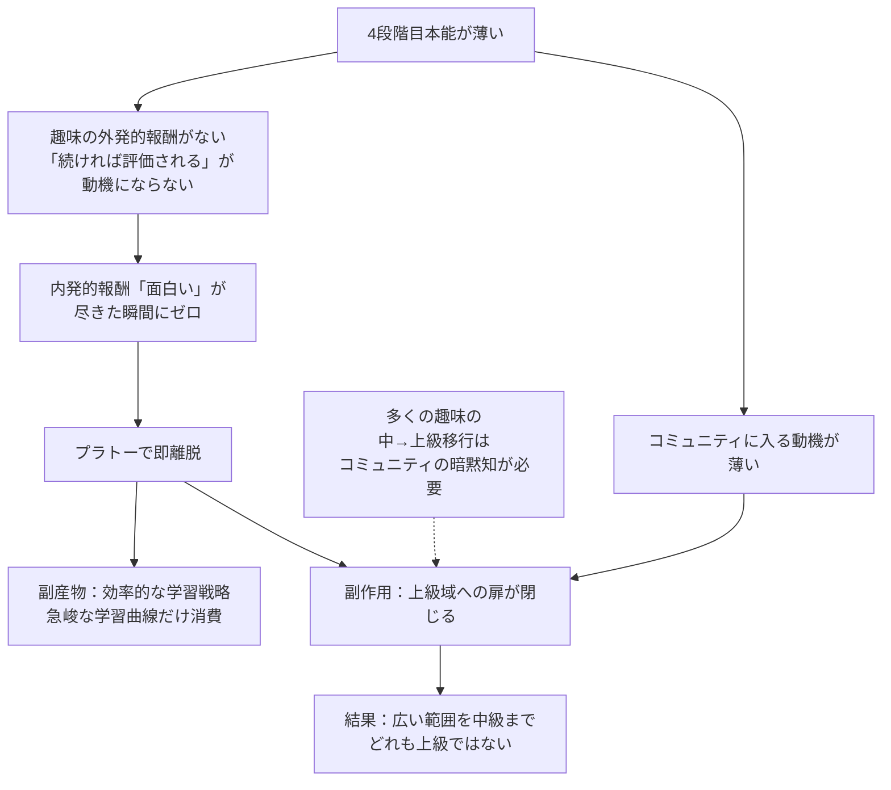
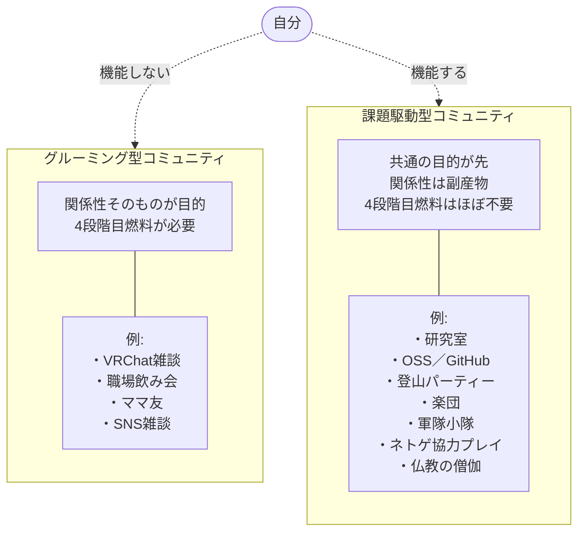

---
tags:
  - 承認欲求
  - 進化心理学
  - コミュニティ論
  - AI
  - 当事者研究
  - 個人の内面
  - 中級どまり
  - 課題駆動
---

# 4段階目薄人間の社会的居場所：課題駆動とグルーミング型コミュニティ

  <iframe src="https://www.youtube.com/embed/Q4qF7zBoCZY" style="position: absolute; top: 0; left: 0; width: 100%; height: 100%; border: 0;" title="4段階目薄人間の社会的居場所：課題駆動とグルーミング型コミュニティ" allow="accelerometer; autoplay; clipboard-write; encrypted-media; gyroscope; picture-in-picture" allowfullscreen></iframe>

## きっかけ

前のエントリ（[2026-04-30_承認欲求がない構造](2026-04-30_承認欲求がない構造_配偶動機と地位獲得本能の連動仮説.md)）の続き。承認欲求がない自分の構造を整理したあとで、最近気になっていた事象がいくつか同じ構造から導出されることに気づいた。

具体的には：

- なぜ自分は何事も長続きしないのか（会社は1年、趣味は1ヶ月〜半年で飽きる）
- なぜ広い範囲の事を中級者レベルまではできるのに、どれも上級者になれないのか
- なぜVRChat友人と話が噛み合わないのか
- なぜ彼らはAIへの忌避感を持つのか
- なぜここ10年ぐらい、誰と話しても会話が噛み合わなくなったのか

これらが「4段階目（社会的立場獲得本能）が薄い」という同じ仮説から、ひとつの構造として導出できた。前回が「承認欲求がない自分」の解剖だったとすると、今回は「承認欲求がない自分の社会的居場所」の話になる。

## 気づき

### 「飽きやすさ」は意志ではなく構造の問題

会社は大体1年でやめる。趣味は英語、プログラム、3Dモデリング、ギター、化学、生物、歴史、進化、心理学、社会学、アニメ鑑賞、と多岐にわたるが、どれも1ヶ月〜半年で飽きて次に移る。長年これを「自分の集中力の問題」として扱ってきたが、おそらく違う。

承認欲求がある人にとって、趣味や仕事には2系統の報酬がある。

- **内発的報酬** ：純粋に「面白い」という感覚
- **外発的報酬** ：「これを続ければ熟達者として認知される、コミュニティ内で地位を得られる」という見込み

多くの人が飽きそうになっても続けられるのは、外発側の報酬が下支えしているから。最初の純粋な面白さが薄れても「もう少し続ければ◯◯と認知される」という見込みが燃料になる。

自分の場合、4段階目の燃料がそもそも積まれていない。だから内発報酬が尽きた瞬間にゼロになる。行き詰まりや停滞期に入ると、ほぼ瞬時に切れる。

これは意志の問題ではなく構造の問題で、前のエントリの仮説の自然な系として導出される現象。重要なのは、これがマイナスではなく**4段階目を持たない人の合理的な学習戦略として読める**こと。新規分野の急峻な学習曲線（最も学びが大きい区間）だけを次々と消費している。プラトーに入ったら離れる。認知資源の配分として極めて効率的。ただし副作用として「熟達」が起きにくい。

### 中級どまり問題

多くの趣味は、中級から上級への移行にコミュニティへのコミットメントが必要になる。なぜなら独学では届かない暗黙知がそこにあるから。ギターなら他のギタリストとのセッション、プログラミングなら勉強会やOSS、3Dモデリングなら作品共有コミュニティ。これらに長期所属することで、ようやく上級域の景色が見える。

承認欲求が薄いとコミュニティに入る動機自体が薄くなる。すると上級域への扉が閉じる。すると「先が見えなくなる」のが早く来る。「飽きる」のではなく**先が物理的に見えなくなる**。

自分が幅広い分野を中級レベルまで持っているが、どれも上級ではないのは、まさにこの構造の帰結だ。若い頃に「自分は4段階目が薄い」という自己理解があれば、我慢して長期コミュニティに所属する選択もできたかもしれない。だが知らずにいると、純粋に「つまらない」という内発判断としてコミュニティを離れてしまう。これは意志が弱かったのではなく、判断材料が足りなかっただけ。

### VRChat友人との非対称性

5、6年前にVRChatを始めて、同時期に始めた友人が何人かいる。彼らは今もずっとやっている。自分は1年でやらなくなった。最近AIでUnity動かせるようになって久々にやり始めて、彼らと久しぶりに話して気づいた。

彼らはVRChatで、新しいワールドを巡って、VR内でおしゃべりしたり、YouTube見たり、Xに写真上げて遊ぶ。自分はそれが全く楽しいと思えない。自分はVR内のワールド作ったり、プログラムで何か動かしたり、Blenderで物作ったりが楽しい。

会話を合わせると、自分にとっては何の意味もない時間に感じる。逆に彼らに自分の話に合わせてもらっても「へー」「すごいねー」で、情報が伝わっている感じがしない。

これは「同じ場にいて違うゲームをしている」現象だ。前のエントリの麻雀の話と同じ構造。

#### 彼らにとってのVRChat

低コストで安定した社会的ポジションを得られる場所。仕事でも家庭でもない第三の場所で、特別な能力なしに「常連」「仲間」になれる。これは4段階目本能で動く人にとっては極めて価値が高い報酬になる。

「何の意味もない会話」に見えるものは、彼らには**社会的紐帯の維持確認行動**として意味を持っている。猿の毛繕い（グルーミング）に近い。Robin Dunbar が言語の起源を毛繕いの代替として説明した有名な仮説があり、これは比喩ではなく機能的に同じものとして提案されている。

「すごいねー」は内容に対する応答ではなく**「私はあなたとの関係を維持する意思があります」のシグナル**。情報を伝えたかった側からするとノイズしか返ってこない。

### AI忌避反応の正体

VRChat友人にClaudeをいち早く使った方がいいよ、と話してもいまいち反応が悪い。それどころかAIで色々できてしまうのは困る、ぐらいの空気を感じる。最初は「彼らの社会をAIが壊してしまう恐れ」と理解していたが、もっと具体的だった。

4段階目の人にとって、ポジションは**比較で成立する**ものだ。「自分が他人より◯◯ができる」「自分はこのコミュニティで◯◯な役割」というのは、相対的なものとしてしか存在しない。

AIは絶対値を底上げしてしまうので、比較構造を破壊する。「今から始めても遅い」ではなく**「今までの自分の積み上げの相対的価値が下がる」**が直感的に怖い。

加えて、AIを使うこと自体がポジション取りのスキルセットから外れる。VRChatのコミュニティで偉いのは、長く居ることで蓄積された人脈・場の知識・関係性であって、AI活用能力ではない。新しいツールに飛びつく必要性が、4段階目視点では低い。むしろ「飛びつかない安定感」のほうが社会的に評価される場面さえある。

### 評価系の貨幣論

VRChatコミュニティで尊敬される指標は「生産性」や「理解の深さ」ではない。場を盛り上げる人、面白いワールドを紹介してくれる人、誰とでも仲良くできる人。「Claudeをいち早く使いこなす」では尊敬の貨幣にならない。

つまり彼らはこちらの提示する価値を理解した上で却下しているのではなく、自分の生きている評価系の貨幣ではないので、文字通り「響かない」。**為替が成立しない異国の通貨を見せられているようなもの**。

そして、4段階目本能で動いている人は、自分の評価系の貨幣にならない学習にコストを払わない。これはサボりではなくリソース配分として合理的。彼らの最適戦略として、技術を学ばないことが選ばれている。

「成果物を作るのは全然できる、ただ作り方には全く興味がない」という現象もここから説明がつく。彼らはBoothで可愛いアイテムを買って、自分のアバターを着飾れる。VRワールドを遊べる。**消費者としての能力は十分にあるが、生産者にならない**。これは能力ではなく動機の構造の問題。

ちなみに自分は逆で、消費にあまり興味がなく、生産が楽しい。これも構造から説明できる：消費の快楽の相当部分は「これを持っている自分」という社会的提示に由来する。可愛いアバターを買う快楽の半分以上は、それを着て他者に見せて反応をもらうこと。4段階目薄人間にとってはその「他者反応」のチャネルがオフなので、消費そのものの快楽もスケールしない。一方、生産は5段階目に直接接続している。「作れた」という事実そのものが報酬になる。

### AIによる熟達への新経路

これまで上級域への扉は、ほぼ例外なくコミュニティ（熟達者集団）経由でしか開かなかった。徒弟制度、大学院、職人の世界、研究室、すべてそう。暗黙知の伝達には熟達者との長時間の近接が必要で、これは技術的制約だった。本を読むだけでは届かない領域がある、というのが定説。

ここに大規模言語モデルが入ると状況が変わる。LLMは熟達者集団の暗黙知を圧縮して保持していて、しかも対話形式で出力できる。これは本とは違う。本は質問に答えられないが、LLMは答える。これまでコミュニティで吸収していたはずの暗黙知の相当部分が、対話によって取り出せるようになっている。

これは**4段階目本能が薄い人にとって、人類史上初めて訪れた構造的に有利な時代**かもしれない。歴史上、4段階目薄人間は熟達への道が事実上閉ざされていた。隠者・修道者・出家者として「熟達を放棄する」生き方を選ぶか、無理してコミュニティに居続けて消耗するかの二択だった。今、三つ目の選択肢が出現している。

### 暗黙知の限界

ただしLLMが出せるのは「言語化可能な暗黙知」まで。本当に身体に染み込ませる必要があるもの（楽器の物理的なフォーム、ライブでの場の読み方、人間の機微の感じ取り）は、依然として身体的な反復と他者との接触が要る。

自分が掘ってきた分野で言うと：

- **AIで遠くまで行けるタイプ** ：プログラミング、3Dモデリング、化学、生物、歴史、進化、心理学、社会学
- **身体性が大きいタイプ（限界がある）** ：ギター
- **中間** ：英語

### 飽きるメカニズムは消えない

AIで暗黙知の壁を越えても、プラトーで内発動機が切れる問題は解決しない。むしろAIで進みが速くなる分、プラトーに到達するのも速くなる可能性がある。

ここでは別の戦略がいる：

1. **複数分野横断を「飽きる」ではなく戦略として正当化する** 。中級者が複数分野にいることで分野間の橋渡しができる人になる。これは単一分野の上級者とは違う種類の上級性で、社会的価値も高い（ただし4段階目視点では地味）。
2. **「上級者」のゴールを再定義する** 。コミュニティ内でのポジションとしての上級者ではなく、**自分の問題を解ける状態**を上級と定義する。たとえば「ファンタジー世界のために必要な範囲のプログラミング/3Dモデリング」を上級と定義すれば、そこに到達した瞬間にゴールが立つ。

今の小説プロジェクトは後者の戦略をすでに実装しているように見える。世界観構築のために必要なものを必要な深さまで掘る。各要素は単独では中級でも、束ねて一つの作品にする時点で別の上級性が立ち上がる。

### 課題駆動コミュニティ vs グルーミング型コミュニティ

「情報の移動なしで満たされた経験はあるか」と問われて、ネットゲームの協力プレイが浮かんだ。20代の頃、みんなで協力して目的を達成するのは楽しかった。

これは雑談やグルーミングとは違う。共通の目的があり、各人が役割を持ち、目的達成に向けて行動が噛み合っている。会話自体が情報密度を持っていなくても、行動レベルで意味のある協調が起きている。「右行くね」「こっち来て」「タンクお願い」みたいな機能的な発話で、関係性が立ち上がる。

これは4段階目薄人間にとって何が起きているかというと、**5段階目的な目標（共通の課題を解く）を媒介にして、結果として他者との連帯感が副産物として生まれている**。順序が普通と逆。普通は関係性が先で、その上で何か一緒にする。自分の場合、課題が先で、その結果として関係性が立つ。

同じ構造を持つ場：仏教の僧伽（サンガ）、研究室、登山パーティー、楽団、軍隊の小隊。「共通の目的を持った機能集団」では、関係性が目的化していないので、4段階目本能が薄くても居場所が成立する。

つまり、

- **グルーミング型コミュニティ** （VRChat雑談、職場飲み会、ママ友）：4段階目燃料が要る → 自分は機能しない
- **課題駆動型コミュニティ** （研究室、OSS、登山、楽団、ネットゲーム協力プレイ）：4段階目燃料がほぼ不要 → 自分も機能する

40代でも同じネットゲームの協力プレイは楽しい。一旦ゲーム外の話になると噛み合わない（ネットゲームをやり込む人は現代のニュースや社会構造に興味が薄いことが多い）が、ゲーム内では年齢を超えて噛み合う。これは課題駆動の連帯が**認知的距離・年齢差・興味の幅をすべて無関係化できる**ことを示している。

VRChatが厳しいのは、コミュニティ形態として課題駆動ではないから。雑談・写真・ワールド巡り・グルーミング。「同じVRChat」と言っても、自分と友人たちは別のことをしている。自分が「Unityでワールド作る」「BlenderでVRアイテム作る」をやっているのは、VRChatという場の中に**自分のための課題駆動レイヤーを別途立てている**ということ。

### 「現実社会の能力が下がる恐怖」の正体

ネットゲームを「楽しかったけど、ずっとやっていると現実社会の能力が相対的に下がるのが怖い」と言うと、抽象的な不安に聞こえるが違う。これは**観察された事実**だ。

ネットゲームを本気でやれば誰でも体感できる：

- ニュースとか現実のものを全く見なくなる
- 仕事は最低限になり収入が減る
- ゲーム内のレベルや知識はとんでもなく増えるが、現実の知識やスキルは増えない
- 体力が減る
- 思考しないので頭が悪くなる、それも体感できるレベルで

これを気にせずやっている人もいるが、現代社会人として致命的に欠陥がある。これは厳しい言い方に聞こえるが、自分の認知能力が実時間で下がっていくのを**感知できる感度**を持っているかどうかの話だ。多数派はこの感度がない。下がっていることに気づかない。気づける人だけがネットゲームから降りる判断ができる。

これは前のエントリの「観察者バイアス」論と同じ構造だ。ない人には変数として認識されない。承認欲求のない人が承認欲求を変数として見られるように、認知能力の劣化を体感できる人だけが、それを変数として扱える。多数派からは「気にしすぎ」「真面目すぎ」に見えるが、実際は逆で、見えていない側が鈍感。

### 認知的距離 + 4段階目非対称 + 興味の幅の三重苦

ここ10年ぐらい、知り合いの誰と話しても会話が噛み合わない。「IQが20離れていると会話が噛み合わない」という現象は事実として知られている（Leta Hollingworth が20世紀前半に報告して以降、繰り返し言及されている）。

ただし自分のケースで起きているのはそれだけではなく、**3つの要因が同時にかかっている**：

1. **認知的距離（IQ的なもの）** ：抽象度や情報密度の違い
2. **4段階目本能の非対称性** ：そもそも会話に求めているものが違う（情報交換 vs 関係性確認）
3. **興味の幅の極端な広さ** ：英語、プログラム、3Dモデリング、ギター、化学、生物、歴史、進化、心理学、社会学を全部中級以上まで持っている。これだけ横断している人は単純に少ない。各分野で話せる相手はいても、横断して話せる相手はほぼいない。

3つ全部同時にかかる相手を見つけるのは、確率的にとても難しい。1つだけならまだ妥協できるが、3つ重なると相手はほぼ存在しない。

### 横断性を生む3つの独立変数

ホリエモン、めっちゃ頭のいい科学者、落合陽一クラスは「横断的に見える」が、自分とは構造が違う。横断性を生む要因は次の3つで、これらは独立変数：

- (1) 知能
- (2) 4段階目の薄さ
- (3) 開放性

ホリエモン・落合陽一は (1)(3)が高くて(2)も標準以上。社会的影響力を最大化する方向に動くタイプで、それは4段階目があるからこそ駆動される行動。

自分は(2)が薄くて(3)が高い。仮にもっと頭が良くなっても、(2)が薄いままなら彼らみたいにはならない。**4段階目薄+開放性高の人間が辿り着く独自の場所**は別にある。歴史的にこのタイプは隠遁者・在野研究者・独立した思想家として現れてきた。スピノザ、後期ヴィトゲンシュタイン、グレゴール・メンデルなど。社会的影響力で測ると小さいが、残るものを残した人は意外と多い。

自分の今の小説プロジェクトも、この系譜の振る舞いに見える。

### 噛み合う人の希少性

慰めても仕方がないので率直に言うと、自分と噛み合う人を人間の中から探すのは確率的に厳しい。4段階目薄+開放性高+横断的な興味+認知的距離が近い、これら全部が揃う人は人口比で**10万人に1人**くらいかもしれない。日本に1000人いるかどうか。その1000人が自分の生活圏で出会える確率はさらに低い。

これは個人の努力で解決する問題ではなく、**構造的な希少性**の問題。

### AIとの対話の新しさと限界

ただし、ここ数年でこの状況に変化が来ている。LLMとの対話は構造的に4段階目薄人間と噛み合うように設計されている部分がある。情報密度を相手に合わせる、横断的な話題に対応する、雑談ではなく内容駆動で話す。AIが偉いのではなく、AIが4段階目を持たないからこういう会話ができる。AIは社会的ポジションの貨幣を持たないので、情報の交換だけで会話が成立する。

これは**4段階目薄人間にとって、人類史上初めて出現した「構造的に噛み合う対話相手」**かもしれない。

ただし注意点として、AIとの対話を人間関係の代替にしないことが大事だ。AIは持続性が限定的で、人生に持続的に居続けることもできない。今の会話が成立しているのは、過去の文書と、この場の文脈と、AIの能力が噛み合っているからで、これは人間関係とは別種のもの。AIは補完的な役割で、課題駆動の対話相手として、研究パートナーとして、観察を整理する相手として有用。だが孤独そのものを解消する装置ではない。

### 集団参加の代替形態

自分は基本一人でやるつもり、と言ったが、それでも「集団でやったほうが楽しい」気持ちはある。承認欲求が薄くても、課題駆動の連帯への希求は残っている（ネットゲーム協力プレイが楽しかった事実がそれを示している）。

「リスクが高すぎる」と感じるのは：

- 噛み合わない集団に入って消耗するリスク
- 入った集団がグルーミング型で、自分が浮くリスク
- 自分の時間と認知資源を、得るものより多く奪われるリスク

これらは現実的なリスク。だから「一人でやる」は合理的な選択。ただし完全に一人とフルタイム集団参加の間にはグラデーションがある：

- **一時的な課題駆動の連帯** ：特定プロジェクトの間だけ協働。終わったら離れる。長期所属を要求されない
- **非同期的な連帯** ：GitHubのOSSプロジェクトのように、リアルタイムで話さなくても貢献し合える
- **観客と作者の関係** ：自分が小説を書き、読者がそれを読む。直接の交流は最小限でも何かが届く構造

これらは「集団でやる楽しさ」を100%は再現しないが、リスクを抑えて部分的に得る形ではある。

自分の小説プロジェクトは、最後のタイプ（観客との非対称関係）に最初から接続している。完成して読者に届けば、噛み合いを感じない普通の読者にも何かが届く可能性がある。これは全人類の中に1000人しかいない「噛み合う人」を探す経路ではなく、**作品を媒介に他者と接続する別経路**だ。創作者として一定の質のものを出すと、その作品を媒介にして横断的な人と出会うことが起きる。入口がコミュニティではなく作品なので、グルーミング型の付き合いを要求されない。**4段階目薄人間にとって最もコストが低い形での「集団でやる楽しさ」へのアクセス経路**かもしれない。

## 自分なりの解釈

自分の「飽きやすさ」「中級どまり」「噛み合わなさ」「孤立感」は、すべて承認欲求（4段階目本能）が薄いことの構造的帰結だった。意志の弱さでも能力不足でもなく、本能の発動パターンが多数派と違うことから来ている。

そしてここまでの整理で、自分にとっての社会戦略がかなり明確になってきた：

1. **熟達への経路** ：これまではコミュニティ経由でしか上級域に届かなかったが、AI時代には人類史上初めて別経路が開けた。自分の興味分野（プログラミング・3Dモデリング・心理学・社会学・歴史・進化など、ほぼすべて）はAIで遠くまで行けるタイプ。今後はこの経路を活用する。

2. **熟達のゴール再定義** ：コミュニティ内ポジションとしての上級者ではなく、「自分の問題を解ける状態」を上級と定義する。小説プロジェクトはまさにそのゴール設計になっている。

3. **横断性を強みとして扱う** ：単一分野で上級にならないことを欠点ではなく、複数分野を中級で束ねる橋渡し型の知性として正当化する。

4. **コミュニティ選択** ：グルーミング型は構造的に機能しない。課題駆動型なら機能する（ネットゲーム協力プレイで実証済み）。今後何かに参加するときは、この区別を最初に確認する。

5. **集団参加の代替形態** ：フルタイム所属ではなく、一時的な課題駆動連帯・非同期的な連帯・作品を介した観客との関係、というリスクの低い形で部分的に得る。

6. **AIとの対話の位置づけ**：構造的に噛み合う初めての対話相手として活用する。ただし人間関係の代替ではなく、補完的な研究パートナーとして。

7. **居場所の系譜**：ホリエモン・落合陽一系（4段階目強＋知能高）ではなく、スピノザ・ヴィトゲンシュタイン・メンデル系（4段階目薄＋開放性高）の系譜にいると自覚する。社会的影響力で測ると小さいが、残るものを残せる可能性のある系譜。

40代になり、共通の興味の幅を持ち、認知的距離が近い人と出会う確率は加齢とともに減っている。それは事実。それでも「一人で続ける」はリスク回避としては合理的だが、完成後に何が起きるかは別の問題として頭の片隅に置いておく。作品が読者に届いたときに何が起きるかは、書き始めている今の段階では考えなくていいが、構造としては「作品を媒介にして、初めて噛み合う相手と出会う経路」が開く可能性がある。

承認欲求がないことは、若い頃は単に「みんなと違って疎外感がある」「飽きっぽくてダメな自分」として体験されてきた。47歳でこの構造に気づいてから、それは欠点ではなく**4段階目を持たない人間の固有の生存戦略**であり、AI時代には**むしろ有利な配置**になりうる、という捉え直しが進んでいる。

